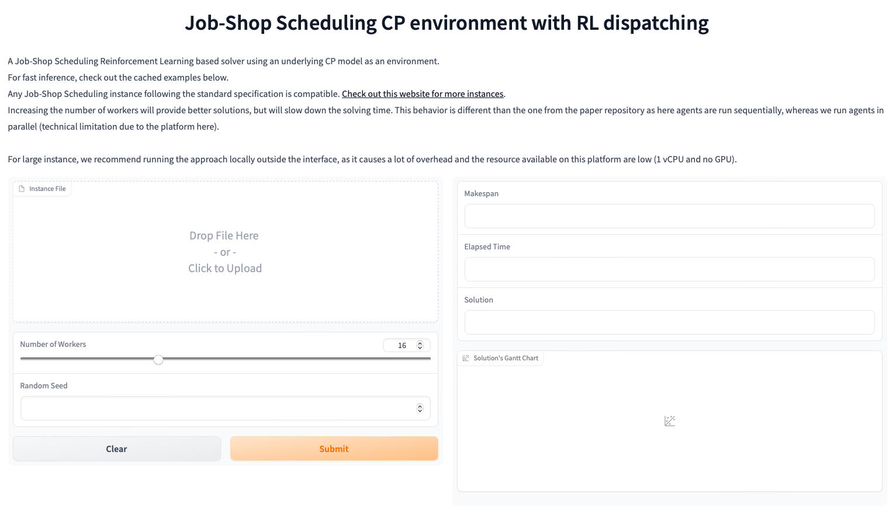

# An End-to-End Reinforcement Learning Approach for Job-Shop Scheduling Problems Based on Constraint Programming [](https://paperswithcode.com/sota/scheduling-on-taillard-instances?p=an-end-to-end-reinforcement-learning-approach)

This repository contains the source code for the paper "An End-to-End Reinforcement Learning Approach for Job-Shop Scheduling Problems Based on Constraint Programming".
This works propose an approach to design a Reinforcement Learning (RL) environment using Constraint Programming (CP) and a training algorithm that does not rely on any custom reward or observation for the job-shop scheduling (JSS) problem.

Check out our HugginFace 🤗 [Space demo](https://huggingface.co/spaces/pierretassel/JobShopCPRL):

[](https://huggingface.co/spaces/pierretassel/JobShopCPRL)


## Installation

To use the code, first clone the repository:

```bash
git clone https://github.com/ingambe/End2End-Job-Shop-Scheduling-CP.git
```

It is recommended to create a new virtual environment (optional) and install the required dependencies using:

```bash
pip install -r requirements.txt
```

**Alternatively, you can build a docker container using the docker file at the root of the repository**

## Training the Reinforcement Learning Agent

The `main.py` script allows training the agent from scratch:

```bash
python main.py
```

You can train your agent on different instances by replacing the files in the `instances_train/` folder.

The pre-trained checkpoint of the neural network is saved in the `checkpoint.pt` file.

## Solving benchmark instances

The `fast_solve.py` script solves the job-shop scheduling instances stored in the `instances_run/` folder and outputs the results in a `results.csv` file. For better performance, it is recommended to run the script with the `-O` argument:

```bash
python -O fast_solve.py
```

To obtain the solutions using the dispatching heuristics (`FIFO`, `MTWR`, etc.), you can execute the script `static_dispatching/benchmark_static_dispatching.py`

## Looking for the environment only?

The environment only can be installed as a standalone package using

```bash
pip install jss_cp
```

For extra performance, the code is compiled using MyPyC
Checkout the environment repository: [https://github.com/ingambe/JobShopCPEnv](https://github.com/ingambe/JobShopCPEnv)

## Question/Need Support?

Open an issue, we will do our best to answer it.

## Citation

If you use this environment in your research, please cite the following paper:

```bibtex
@article{Tassel_Gebser_Schekotihin_2023,
  title={An End-to-End Reinforcement Learning Approach for Job-Shop Scheduling Problems Based on Constraint Programming},
  volume={33},
  url={https://ojs.aaai.org/index.php/ICAPS/article/view/27243},
  DOI={10.1609/icaps.v33i1.27243},
  number={1},
  journal={Proceedings of the International Conference on Automated Planning and Scheduling},
  author={Tassel, Pierre and Gebser, Martin and Schekotihin, Konstantin},
  year={2023},
  month={Jul.},
  pages={614-622}
}
```

## License

MIT License
